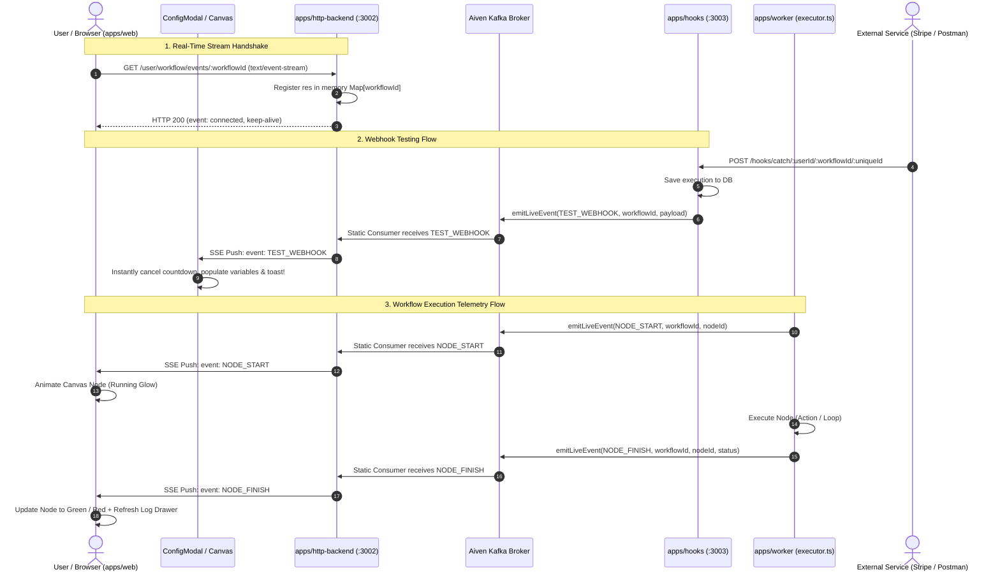

# BuildFlow Live Streaming Architecture Specification
## Real-Time Workflow Telemetry & Webhook Testing via Apache Kafka + Server-Sent Events (SSE)

---

## 1. Executive Summary & Objective

BuildFlow requires real-time streaming capabilities for two core user experiences:
1. **Instant Webhook Testing:** In the workflow canvas configuration modal ([ConfigModal.tsx](file:///f:/BuildFlow/apps/web/app/workflows/[id]/components/ConfigModal.tsx)), users testing an external Webhook trigger must immediately see the payload land the instant it hits [apps/hooks](file:///f:/BuildFlow/apps/hooks), without relying on fragile interval polling.
2. **Live Workflow Execution Telemetry:** When an automated workflow runs, the canvas ([page.tsx](file:///f:/BuildFlow/apps/web/app/workflows/[id]/page.tsx)) must visually pulse and highlight nodes currently executing (`NODE_START`), turn them green or red upon completion (`NODE_FINISH`), and automatically refresh execution history logs in [ExecutionHistoryFooter.tsx](file:///f:/BuildFlow/apps/web/app/components/ExecutionHistoryFooter.tsx) in real time.

This specification describes the **Single-Consumer In-Memory Fan-Out over Kafka + SSE** architecture. Any engineer or AI agent implementing this pipeline must adhere strictly to the design, edge-case protections, and exact file edits detailed below.

---

## 2. Design Rationale: The "Why"

### 2.1 Why SSE (Server-Sent Events) over WebSockets?
- **Unidirectional by nature:** Workflow telemetry and webhook pings flow strictly from the server to the browser (`Server -> Client`). The browser never needs to push raw Kafka events back over the socket.
- **Native HTTP/2 & Firewall Friendly:** SSE operates over standard HTTP (`text/event-stream`), traversing corporate proxies, load balancers, and firewalls without requiring WebSocket upgrade handshakes (`101 Switching Protocols`).
- **Native Browser Resilience:** The browser's native `EventSource` API handles automatic reconnections and backoff out-of-the-box.
- **Zero Additional Protocols:** Keeps the infrastructure lightweight and standard.

### 2.2 Why a Single Static Kafka Consumer Fan-Out over Dynamic Consumers?
- **The Catastrophic Rebalance Storm:** If every browser tab opening a workflow subscribed directly as an individual Kafka consumer or consumer group:
  1. Hundreds of browser connections would join/leave the Kafka cluster.
  2. Kafka would continuously trigger consumer group rebalances, pausing partition consumption for all consumers in the cluster.
- **The Static Fan-Out Pattern:** `apps/http-backend` maintains **one single permanent Kafka consumer** attached to topic `workflow-live-events`. Incoming messages are received in RAM and dispatched in $O(1)$ time to connected browser SSE streams matching the `workflowId` via an in-memory `Map<string, Set<Response>>`.

### 2.3 Why No Redis?
- BuildFlow already has Apache Kafka running (on Aiven Cloud / local fallback) for durable workflow queueing (`First-Client`).
- Introducing Redis solely for live pub/sub introduces dual queue overhead, redundant network hops, and operational debt for a single application. Kafka can effortlessly handle both durable execution dispatch and ephemeral telemetry broadcasting.

### 2.4 Why Minimal Lifecycle Telemetry (START / FINISH Only)?
- **No Per-Item Progress Spam:** When an Iterator node processes 10,000 spreadsheet rows:
  - It emits **one** `NODE_START` event when the node begins execution.
  - It emits **one** `NODE_FINISH` event when all iterations conclude.
- **Guaranteed Lightweight Throughput:** An entire workflow with 5 nodes emits ~10 total telemetry events across its lifecycle (~2 KB total bandwidth). This guarantees BuildFlow stays well below Aiven's 128 KB/s free quota and never overloads browser rendering loops.

### 2.5 Why a Dedicated `@repo/kafka` Package?
- [`@repo/common`](file:///f:/BuildFlow/packages/common) is imported into Next.js frontend code ([apps/web](file:///f:/BuildFlow/apps/web)).
- `kafkajs` uses Node.js system modules (`net`, `tls`, `dns`). Mixing `kafkajs` into `@repo/common` crashes Next.js bundling with *Module not found: Can't resolve 'net'*.
- Dedicated package [`@repo/kafka`](file:///f:/BuildFlow/packages/kafka) centralizes Aiven SASL/SSL credentials, producer singletons, and consumer factories strictly for backend services (`processor`, `worker`, `hooks`, `http-backend`).

---

## 3. End-to-End Architecture & Sequence Flow



---

## 4. Pin-to-Pin Edge Cases & Critical Protections

### 4.1 Memory Leak on Disconnect (`req.on("close")`)
- **Risk:** When a user refreshes the browser, switches pages, or closes the tab, the TCP socket terminates. If the backend fails to unregister the response, the in-memory `Set<Response>` grows indefinitely, causing memory leaks and writing to dead sockets (`ERR_STREAM_WRITE_AFTER_END`).
- **Mitigation:** The SSE route MUST bind `req.on("close", ...)` to remove the response from the active `Set`. If a `workflowId` has 0 remaining subscribers, clean up and delete the key from the `Map`.

### 4.2 Firewalls Dropping Idle HTTP Streams (Keep-Alive Heartbeats)
- **Risk:** Cloud load balancers (AWS ALB, Cloudflare, Nginx) drop idle TCP streams after 30 to 60 seconds of inactivity.
- **Mitigation:** The backend must run a 20-second interval sending an SSE comment or heartbeat:
  ```text
  : ping\n\n
  ```
  Comments starting with a colon `:` are ignored by browser client handlers but keep the TCP connection alive indefinitely.

### 4.3 Broken Polling Elimination in ConfigModal
- **Root Cause of Past Failure:** In [ConfigModal.tsx](file:///f:/BuildFlow/apps/web/app/workflows/[id]/components/ConfigModal.tsx), the old polling effect included `webhookCountdown` in its `useEffect` dependency array. Every second, when `webhookCountdown` ticked down, the effect cleaned up and restarted `setInterval(..., 3000)`, guaranteeing the 3-second poll never elapsed!
- **Mitigation:** Completely eliminate the `setInterval` polling loop. Replace it with an active event listener attached to the workflow's SSE stream.

### 4.4 Cross-Origin Authentication with Cookies
- **Risk:** Native `EventSource` does not support custom headers (e.g. `Authorization: Bearer <token>`).
- **Mitigation:** [apps/http-backend](file:///f:/BuildFlow/apps/http-backend) uses `cookieParser()` and `userMiddleware` which resolves sessions via `getToken({ req, secret: NEXTAUTH_SECRET })`. The frontend `EventSource` connection MUST pass `{ withCredentials: true }` so the browser transmits session cookies across origins.

### 4.5 Telemetry Isolation (Fire-and-Forget)
- **Risk:** If Kafka experiences a temporary network blip or Aiven reboots, we must never fail the underlying user workflow execution.
- **Mitigation:** All calls to `emitLiveEvent(...)` in [apps/hooks](file:///f:/BuildFlow/apps/hooks) and [apps/worker](file:///f:/BuildFlow/apps/worker) MUST be wrapped in non-blocking try/catch logic. If Kafka fails, log a warning and continue normal execution.

### 4.6 Dev Server Hot Reload & Duplicate Consumers
- **Risk:** In development (`ts-node-dev` / nodemon), reloading backend files can re-instantiate multiple Kafka consumers on the same group ID.
- **Mitigation:** Cache the consumer instance or disconnect previous consumers cleanly on `SIGTERM` / `SIGINT`.

---

## 5. Detailed Implementation Blueprint (File by File)

---

### Step 5.1: Centralized Kafka Package ([packages/kafka](file:///f:/BuildFlow/packages/kafka))
*(Status: Already Created & Verified)*

- **File:** [packages/kafka/src/index.ts](file:///f:/BuildFlow/packages/kafka/src/index.ts)
- **Exports:**
  - Topic Constants: `TOPIC_WORKFLOW_EXECUTIONS = "First-Client"`, `TOPIC_LIVE_EVENTS = "workflow-live-events"`
  - Event Types: `WorkflowLiveEvent`, `TestWebhookLiveEvent`, `NodeStartLiveEvent`, `NodeFinishLiveEvent`, `WorkflowFinishLiveEvent`
  - Helpers: `kafka`, `getKafkaProducer()`, `createKafkaConsumer(groupId)`, `emitLiveEvent(event)`

---

### Step 5.2: Link `@repo/kafka` in Backend Services

In each backend service's `package.json`, add `"@repo/kafka": "workspace:*"`:
1. [apps/processor/package.json](file:///f:/BuildFlow/apps/processor/package.json)
2. [apps/worker/package.json](file:///f:/BuildFlow/apps/worker/package.json)
3. [apps/hooks/package.json](file:///f:/BuildFlow/apps/hooks/package.json)
4. [apps/http-backend/package.json](file:///f:/BuildFlow/apps/http-backend/package.json)

Run `pnpm install` at workspace root.

---

### Step 5.3: Update [apps/processor/src/index.ts](file:///f:/BuildFlow/apps/processor/src/index.ts)

#### Objective:
Replace hardcoded `localhost:9092` with `@repo/kafka`.

#### Changes:
1. Remove hardcoded `const kafka = new Kafka(...)` and `const TOPIC_NAME = "First-Client"`.
2. Import `getKafkaProducer` and `TOPIC_WORKFLOW_EXECUTIONS` from `@repo/kafka`.
3. In `main()`, obtain producer via `const producer = await getKafkaProducer()` and publish to `TOPIC_WORKFLOW_EXECUTIONS`.

---

### Step 5.4: Update [apps/worker/src/index.ts](file:///f:/BuildFlow/apps/worker/src/index.ts)

#### Objective:
Replace hardcoded `localhost:9092` with `@repo/kafka`.

#### Changes:
1. Remove hardcoded `new Kafka(...)` and `const TOPIC_NAME = "First-Client"`.
2. Import `createKafkaConsumer` and `TOPIC_WORKFLOW_EXECUTIONS` from `@repo/kafka`.
3. Initialize consumer via `const consumer = createKafkaConsumer("buildflow-worker-group")`.
4. Subscribe to `TOPIC_WORKFLOW_EXECUTIONS`.

---

### Step 5.5: Worker Telemetry in [apps/worker/src/engine/executor.ts](file:///f:/BuildFlow/apps/worker/src/engine/executor.ts)

#### Objective:
Emit `NODE_START`, `NODE_FINISH`, and `WORKFLOW_FINISH` during workflow execution.

#### Exact Injection Points:
1. **Import:**
   ```ts
   import { emitLiveEvent } from "@repo/kafka";
   ```
2. **Node Start (Line ~269, right after `prismaClient.nodeExecution.create`):**
   ```ts
   await emitLiveEvent({
     type: "NODE_START",
     workflowId: data.workflow.id,
     executionId: workflowExecutionId,
     nodeId: node.id,
     startedAt: new Date().toISOString(),
   });
   ```
3. **Node Failure (Line ~356, inside `if (!execute.success)`):**
   ```ts
   await emitLiveEvent({
     type: "NODE_FINISH",
     workflowId: data.workflow.id,
     executionId: workflowExecutionId,
     nodeId: node.id,
     status: "Failed",
     completedAt: new Date().toISOString(),
     error: execute.error,
   });
   ```
4. **Node Success (Line ~374, right after `nodeExecution.update` status Completed):**
   ```ts
   await emitLiveEvent({
     type: "NODE_FINISH",
     workflowId: data.workflow.id,
     executionId: workflowExecutionId,
     nodeId: node.id,
     status: "Completed",
     completedAt: new Date().toISOString(),
   });
   ```
5. **Workflow Finish (At completion of execution queue / when all nodes finish):**
   ```ts
   await emitLiveEvent({
     type: "WORKFLOW_FINISH",
     workflowId: data.workflow.id,
     executionId: workflowExecutionId,
     status: "Completed",
     completedAt: new Date().toISOString(),
   });
   ```

---

### Step 5.6: Webhook Testing Producer in [apps/hooks/src/index.ts](file:///f:/BuildFlow/apps/hooks/src/index.ts)

#### Objective:
Broadcast incoming webhook hits to `workflow-live-events` instantly.

#### Changes:
1. Import `emitLiveEvent` from `@repo/kafka`.
2. Inside `app.post("/hooks/catch/:userId/:workflowId/:uniqueId", ...)`, immediately after creating `workflowExecution`:
   ```ts
   await emitLiveEvent({
     type: "TEST_WEBHOOK",
     workflowId: workflow.id,
     executionId: workflowExecution.id,
     metadata: webhookPayload,
     timestamp: new Date().toISOString(),
   });
   ```

---

### Step 5.7: SSE Connection Manager in [apps/http-backend](file:///f:/BuildFlow/apps/http-backend)

Create a dedicated connection registry service:
**Path:** `apps/http-backend/src/services/sseManager.ts`

#### Responsibilities:
- Holds `clientsByWorkflow = new Map<string, Set<Response>>()`.
- Method `addClient(workflowId: string, res: Response): void`:
  - Inserts response into set.
- Method `removeClient(workflowId: string, res: Response): void`:
  - Removes response. If set is empty, deletes key from map.
- Method `broadcastToWorkflow(workflowId: string, event: WorkflowLiveEvent): void`:
  - Formats SSE packet:
    ```text
    event: <event.type>\n
    data: <JSON.stringify(event)>\n\n
    ```
  - Writes to all active response streams in the set. Catches socket write errors and removes failing sockets.
- Export as a singleton `sseManager`.

---

### Step 5.8: Static Kafka Consumer in [apps/http-backend](file:///f:/BuildFlow/apps/http-backend)

Create consumer lifecycle service:
**Path:** `apps/http-backend/src/services/liveEventsConsumer.ts`

#### Responsibilities:
- Imports `createKafkaConsumer`, `TOPIC_LIVE_EVENTS`, and `WorkflowLiveEvent` from `@repo/kafka`.
- Creates consumer with group `groupId: "http-backend-live-events-group"`.
- In `initLiveEventsConsumer()`:
  - Connects consumer and subscribes to `TOPIC_LIVE_EVENTS` (with `fromBeginning: false`).
  - In `eachMessage`:
    - Parses `const event = JSON.parse(message.value.toString()) as WorkflowLiveEvent`.
    - If `event.workflowId` exists:
      - Calls `sseManager.broadcastToWorkflow(event.workflowId, event)`.

#### Boot Initialization in [apps/http-backend/src/index.ts](file:///f:/BuildFlow/apps/http-backend/src/index.ts):
- In `startServer()`, call:
  ```ts
  await initLiveEventsConsumer();
  ```

---

### Step 5.9: SSE Endpoint in [apps/http-backend/src/routes/userRoutes/userRoutes.ts](file:///f:/BuildFlow/apps/http-backend/src/routes/userRoutes/userRoutes.ts)

#### Objective:
Provide `GET /user/workflow/events/:workflowId` authenticated via `userMiddleware`.

#### Route Implementation Details:
1. **Route Definition:**
   `router.get("/workflow/events/:workflowId", userMiddleware, async (req: AuthRequest, res: Response) => { ... })`
2. **Authorization Verification:**
   Query `prismaClient.workflow.findFirst({ where: { id: workflowId, userId: req.user.sub || req.user.id } })`. If not found, return `403 Forbidden`.
3. **SSE Headers:**
   ```ts
   res.setHeader("Content-Type", "text/event-stream");
   res.setHeader("Cache-Control", "no-cache, no-transform");
   res.setHeader("Connection", "keep-alive");
   res.setHeader("X-Accel-Buffering", "no"); // Disables Nginx response buffering
   res.flushHeaders();
   ```
4. **Initial Handshake & Registration:**
   ```ts
   res.write(`event: connected\ndata: ${JSON.stringify({ workflowId })}\n\n`);
   sseManager.addClient(workflowId, res);
   ```
5. **Heartbeat Timer:**
   ```ts
   const heartbeatInterval = setInterval(() => {
     res.write(": ping\n\n");
   }, 20000);
   ```
6. **Socket Close Cleanup:**
   ```ts
   req.on("close", () => {
     clearInterval(heartbeatInterval);
     sseManager.removeClient(workflowId, res);
   });
   ```

---

### Step 5.10: Frontend SSE Hook in [apps/web](file:///f:/BuildFlow/apps/web)

Create a custom hook:
**Path:** `apps/web/app/hooks/useWorkflowEvents.ts`

#### Hook API:
```ts
interface UseWorkflowEventsOptions {
  workflowId: string | null;
  onTestWebhook?: (payload: any) => void;
  onNodeStart?: (nodeId: string, startedAt: string) => void;
  onNodeFinish?: (nodeId: string, status: "Completed" | "Failed", error?: string) => void;
  onWorkflowFinish?: (status: "Completed" | "Failed") => void;
}
```
- Instantiates `new EventSource(`${BACKEND_URL}/user/workflow/events/${workflowId}`, { withCredentials: true })`.
- Attaches `addEventListener("TEST_WEBHOOK", ...)`, `addEventListener("NODE_START", ...)`, etc.
- Handles clean `eventSource.close()` on unmount or `workflowId` change.

---

### Step 5.11: Frontend Integrations

#### 1. Instant Webhook Test in [ConfigModal.tsx](file:///f:/BuildFlow/apps/web/app/workflows/[id]/components/ConfigModal.tsx):
- Remove lines 180–244 (the broken `setInterval` polling that was resetting every 1s).
- Call `useWorkflowEvents`:
  - Pass `onTestWebhook: (data) => { ... }`.
  - On trigger:
    - Sets listening state to false.
    - Sets countdown to 0.
    - Updates Redux test output.
    - Triggers green success toast: *"Webhook payload received in real time!"*.

#### 2. Live Node Glow in [page.tsx](file:///f:/BuildFlow/apps/web/app/workflows/[id]/page.tsx):
- Use `useWorkflowEvents`:
  - On `onNodeStart(nodeId)`: Updates node state in React Flow canvas to `status: "running"`, adding an animated glowing border.
  - On `onNodeFinish(nodeId, status)`: Sets node state to `"completed"` or `"failed"`.

#### 3. Real-Time Log Drawer in [ExecutionHistoryFooter.tsx](file:///f:/BuildFlow/apps/web/app/components/ExecutionHistoryFooter.tsx):
- When `onWorkflowFinish` or `onNodeFinish` fires, immediately invoke `fetchExecutionLogs()` so the logs drawer updates instantly without waiting for the 5-second interval.

---

## 6. Verification & Acceptance Criteria

When implementation is complete, the following tests must pass:
1. **Webhook Test Verification:**
   - Open Webhook node in canvas -> click "Listen for Webhook".
   - Send curl/Postman request to `http://localhost:3003/hooks/catch/...`.
   - Payload must appear in the modal **instantly (< 500ms)** without any interval polling.
2. **Live Execution Animation Verification:**
   - Click "Execute" in [WorkflowToolbar.tsx](file:///f:/BuildFlow/apps/web/app/workflows/[id]/components/WorkflowToolbar.tsx).
   - Canvas nodes must sequentially glow when starting, and turn green upon finishing.
3. **Iterator Batch Protection:**
   - Execute a workflow where an iterator handles 100+ items.
   - Inspect Kafka metrics: exactly **one** start event and **one** finish event emitted for the node. Zero per-item spam.
4. **Memory Cleanliness:**
   - Connect 10 browser tabs to the same workflow, then close 9 tabs.
   - Check `sseManager`: exactly 1 active client remains. Closed sockets are purged cleanly.
